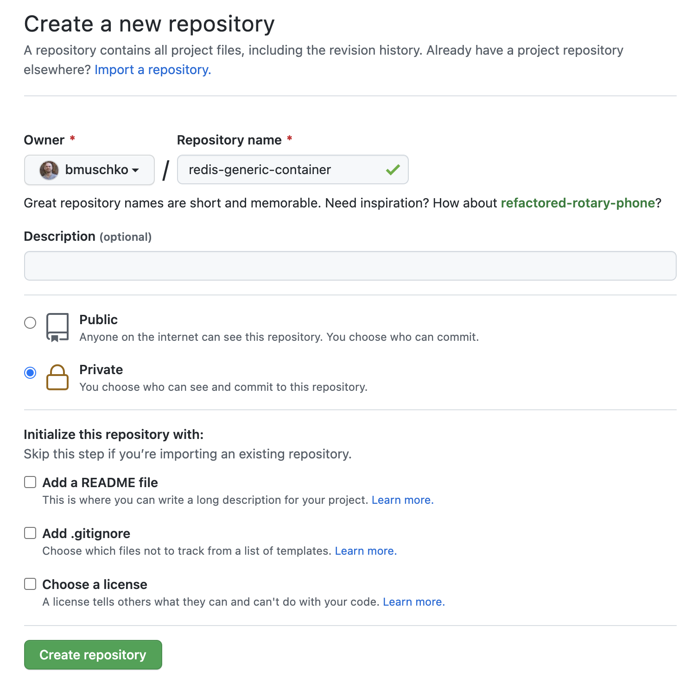
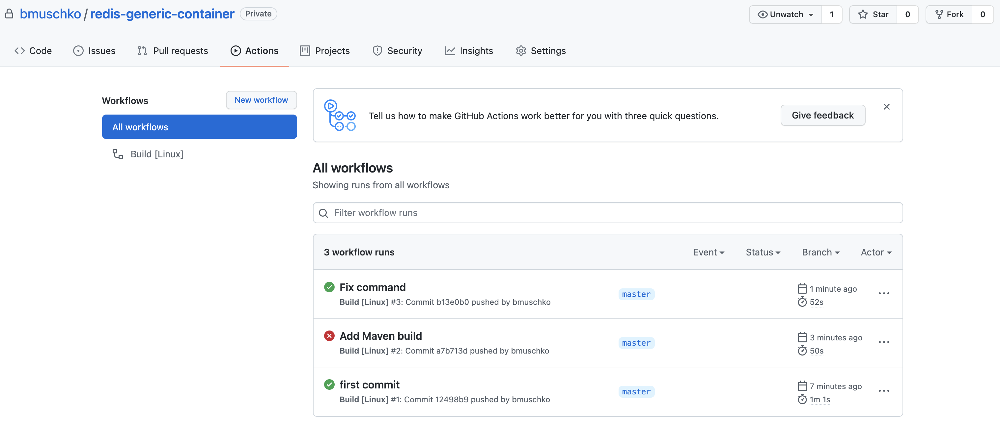

# Solution

Create the repository on GitHub. In this case, the repository name is `redis-generic-container`. You can chose to set the repository visibility to "public" or "private".



Create a local directory with the same name the repository.

```
$ mkdir redis-generic-container
$ cd redis-generic-container
```

Copy the contents of one of the solution directories e.g. `01-redis-generic-container/solution` into the directory. Create the GitHub Actions workflow in the file `.github/workflows/build.yaml` with the following contents.

```
name: Build [Linux]
on: [push, pull_request]

jobs:
  build:
    name: Build
    runs-on: ubuntu-20.04
    steps:
    - uses: actions/checkout@v2
    - name: Setup Java
      uses: actions/setup-java@v1
      with:
        java-version: 11
    - name: Build with Gradle
      uses: gradle/gradle-build-action@v2
      with:
        arguments: build
    -  name: Build with Maven
       run: ./mvnw test
```

Initialize the directory as Git repository, commit the files, and push them to the remote repository. Note that the `git remote add origin` needs to point to your repository URL.

```
$ git init
$ git add .
$ git commit . -m "first commit"
$ git remote add origin git@github.com:bmuschko/redis-generic-container.git
$ git push -u origin master
```

You will see the build executions under the "Actions" tab of your Git repository.


